# Olá, eu sou Arthur Gaspar 👋

### Estudante, pesquisador e desenvolvedor em formação

---

## 👨‍💻 Sobre mim

- 🎓 Estudante do **Técnico em Química Integrado ao Ensino Médio — IFMA Campus Imperatriz**
- 🔬 Desenvolvo projetos de pesquisa nas áreas de **fitoquímica, microbiologia e ecotoxicologia**
- 🌐 Também desenvolvo sites, painéis administrativos e automações
- 📚 Atualmente aprofundando meus conhecimentos em **Java, bancos de dados e arquitetura de software**
- 🚀 Gosto de transformar ideias ambiciosas em projetos reais — às vezes com alguns bugs no caminho, para manter a humildade

---

## 📊 Estatísticas do GitHub

---

## 🧰 Tecnologias e ferramentas

  

---

## 🚧 Projetos em destaque

<table>
<tr>
<td width="50%" valign="top">

### 🎮 Skylix Network

Rede de Minecraft com arquitetura modular em estágio inicial, sistema de login, lobby, SkyWars, cosméticos, clãs, caixas misteriosas e integração com bancos de dados.

**Tecnologias:** Java, Maven, Spigot, ProtocolLib, PlaceholderAPI, MySQL e SQLite.

</td>
<td width="50%" valign="top">

### 🔬 Pesquisa científica

Projetos envolvendo plantas do IFMA, extração de compostos, caracterização fitoquímica, atividade antimicrobiana e ensaios ecotoxicológicos.

**Áreas:** Química, microbiologia, botânica e análise de dados.

</td>
</tr>
<tr>
<td width="50%" valign="top">

### 🌐 Mais Digital

Site institucional e painel administrativo para gerenciamento de clientes, pagamentos, leads, tarefas e relatórios.

**Tecnologias:** HTML, CSS, JavaScript, Supabase e Mercado Pago.

</td>
<td width="50%" valign="top">

### 🤖 Automações e inteligência artificial

Experimentos com agentes, integração entre modelos de IA, ferramentas de desenvolvimento e controle remoto de ambientes de programação.

**Foco:** produtividade, desenvolvimento assistido e automação de fluxos.

</td>
</tr>
</table>

---

## 🐍 Snake das contribuições

<picture>
  <source media="(prefers-color-scheme: dark)" srcset="https://raw.githubusercontent.com/gaspararthur/gaspararthur/output/github-contribution-grid-snake-dark.svg">
  <source media="(prefers-color-scheme: light)" srcset="https://raw.githubusercontent.com/gaspararthur/gaspararthur/output/github-contribution-grid-snake.svg">
  
</picture>

---

## 🌐 Onde me encontrar

  

### “Construindo hoje o que ainda parece ideia de amanhã.”

